## Tomcat-Attack-Chain-personalproject5

## Overview
• In this project I demonstrated what an attacker might do after gaining external access, including initial enumeration, credential harvesting, SSH key extraction, privilege escalation, persistence, lateral movement preparation. 

## Objective
• Perform a full attack chain simulation by identifying vulnerable services, gaining initial access through a vulnerable service,  gathering critical information, and establishing total control over the target system through post-exploitation, persistence techniques, and credential harvesting

## Architecture
I completed this simulation in my homelab using both my kali and ubuntu vitual machines. They were on a NAT network called "LAB" which is isolated from the internet making it a great environment for this project.

## Tools Used
• nmap 
• msfvenom
• hydra
• netcat 

## Recon/ Scanning methodology
nmap -A -sC (Metasploitable-ip)

## Attack Methodogy
• Looking at the results from my nmap scan I could see that the target was metasploitable which is notorious for being extremely vulnerable leaving many services exposed creating a large. Although there were many options in regarding the attack surface, I chose to attempt to gain initial access through the eposed service tomcat on port 8080. Tomcat's web is known for using default credentials for it's login panel.

• I ran a hydra brute force attack against the Tomcat login page located at the /manager/html directory where you are prompted to enter to the correct credentials needed in order to access the backend web application manager page to test if the target was using default credentials. 
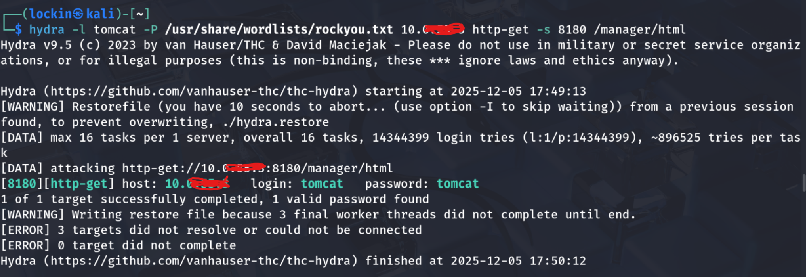
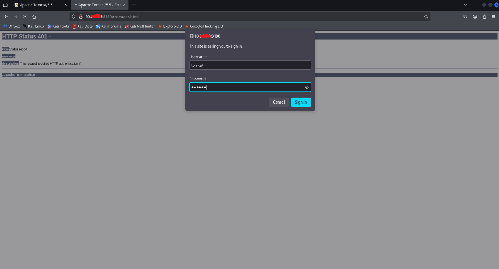

## Findings
• Tomcat was configured with default credentials which as a reslut granted me access to the web application manager page. On this page I see that it was allowed war extension files to be uploaded and executed, I immidiately thought of creating and uploading a war reverse shell with msfvenom. 
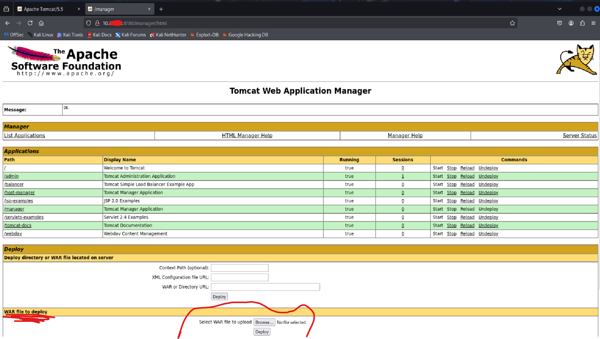
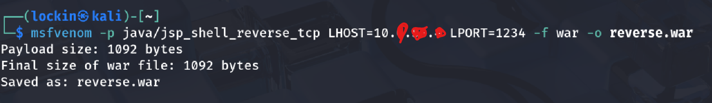
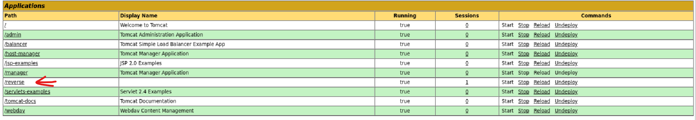
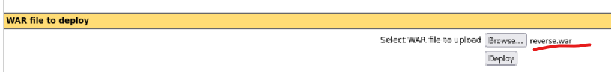

• Before I lauched the shell within the panel, I setup a netcat listener in order to catch the shell so I could execute commands from my attacker machine (kali). I then caught the shell and began trying to find information about the target as well as the stabilizing the shell, the reason being for more functionality and durability. There are many ways to stabilize your shell, as you can see i tried to using python3 and it didn't work but when I used the regular version of python it worked. 
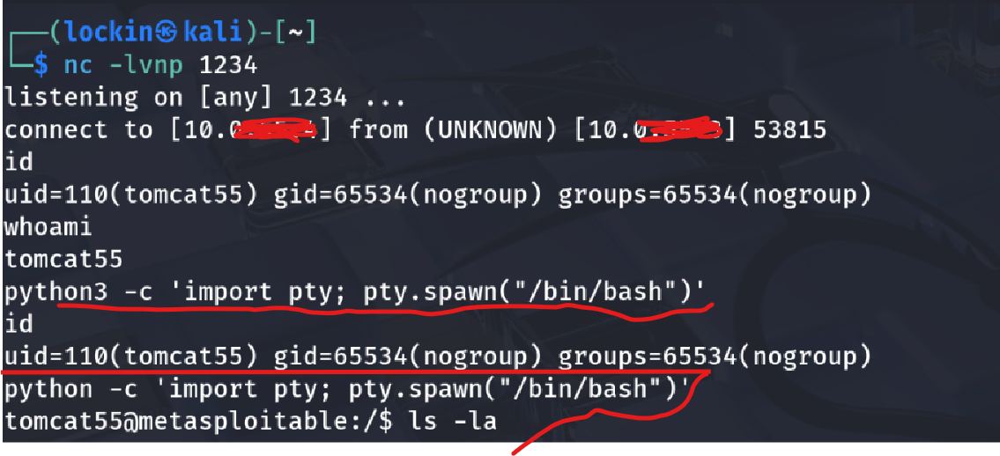

• After stabilizng my shell I began to look through the target to see what I had access to, pivot to other users and access their files as well, I didn't have much permissions. This led me to attempt to escalate my privileges to the root use, I searched for suid binaries as those can possibly have vulnerabilities within them that I could take advantage of. 

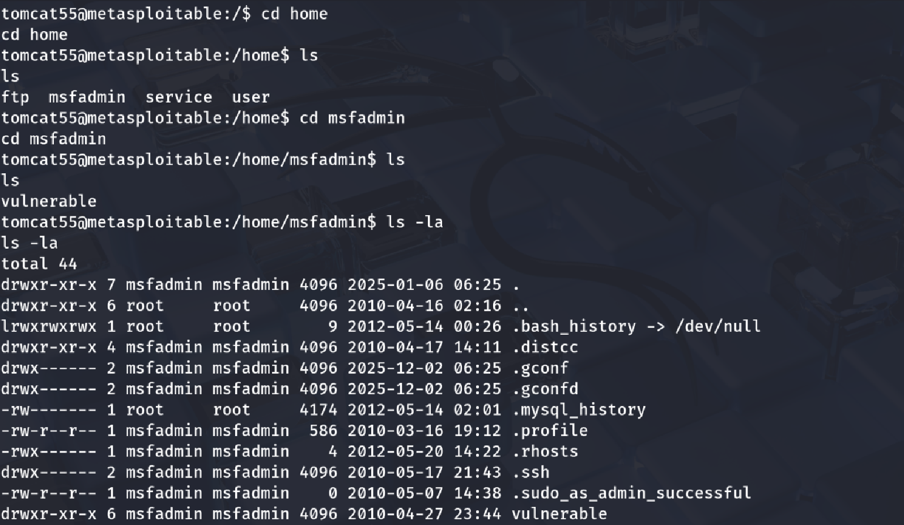

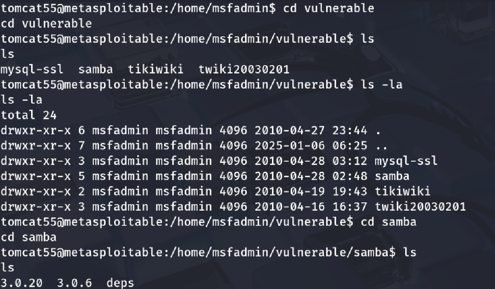
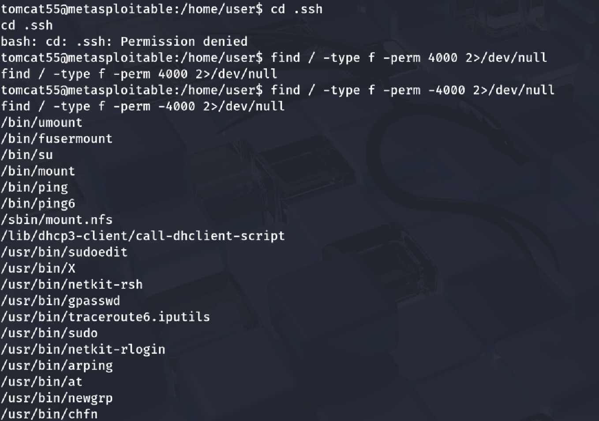

• I discovered that there was a vulnerable nmap suid binary that is usually never there. I went on GTFObins and saw that the nmap binary could be used to escalate privileges. It would affect all of the older versions nmap so I strongly felt that it would work considering mostly everything on this machine was outdated and exposed. 
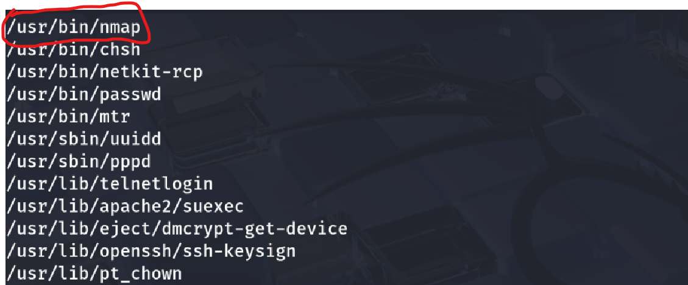

• The nmap suid binary allowed me to escalate privileges resulting in me becoming the root user:
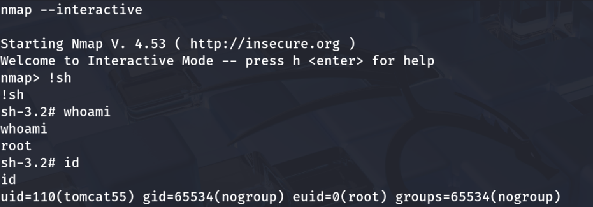

## Recommendations
## MITRE ATT&CK Mapping
## Conclusion
## Lessons Learned

