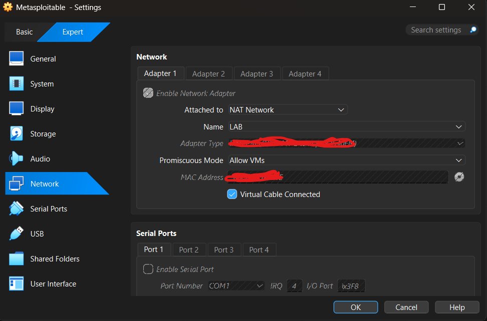
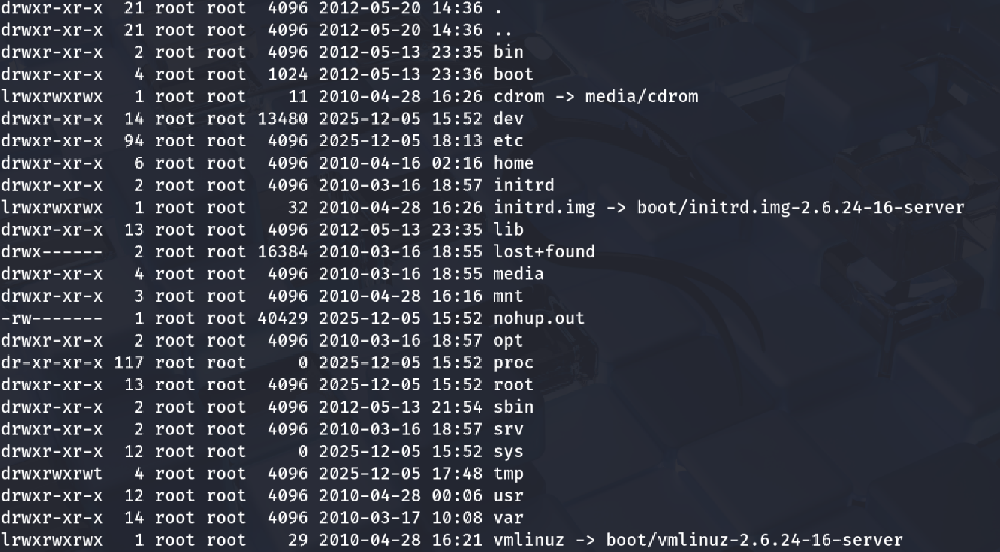

## Tomcat-Attack-Chain-personalproject5

## Overview
• In this project I demonstrated what an attacker might do after gaining external access, including initial enumeration, credential harvesting, SSH key extraction, privilege escalation, persistence, lateral movement preparation. 

## Objective
• Perform a full attack chain simulation by identifying vulnerable services, gaining initial access through a vulnerable service,  gathering critical information, and establishing total control over the target system through post-exploitation, persistence techniques, and credential harvesting

## Architecture
I completed this simulation in my homelab using both my kali and ubuntu vitual machines. They were on a NAT network called "LAB" which is isolated from the internet making it a great environment for this project.

## Tools Used
• nmap 
• msfvenom
• hydra
• netcat 

## Recon/ Scanning methodology
nmap -A -sC (Metasploitable-ip)

## Attack Methodogy
• Looking at the results from my nmap scan I could see that the target was metasploitable which is notorious for being extremely vulnerable leaving many services exposed creating a large. Although there were many options in regarding the attack surface, I chose to attempt to gain initial access through the eposed service tomcat on port 8080. Tomcat's web is known for using default credentials for it's login panel.

• I ran a hydra brute force attack against the Tomcat login page located at the /manager/html directory where you are prompted to enter to the correct credentials needed in order to access the backend web application manager page to test if the target was using default credentials. 

## Findings
• The Apache Tomcat Manager was configured with default credentials, which allowed access to the web application management interface. The manager permitted WAR file uploads and execution. I leveraged this by uploading a WAR reverse shell payload using msfvenom to gain an initial foothold. 

• I prepared a netcat listener on my attacker machine (kali) before I executed it successfully received a reverse shell by triggering the deployed WAR shell. I stabilized the shell to improve usability and reliability allowing enhanced command execution for post exploitation activity.  

• I conducted enumeration after gaining the shell in search of  accessible resources, assess permissions, and paths for privilege escalation. Due to limited user privileges I began to look for vertical escalation techniques and enumerated SUID binaries on the target system.

•  I identified an SUID-enabled nmap binary which is uncommon and a high risk misconfiguration especially in older systems. I referenced GTFObins validate that the nmap binary was a potential exploitation path.  

• Knowing that the target "metasploitable" has a large attack surface and misconfigurations,  it ended up being succeptible to the binary so I abused it. The nmap suid binary allowed me to escalate privileges resulting in me becoming the root user.

• With root access, I enumerated user home directories and confirmed that I had access to sensitive user artifacts including ssh keys.

• Extracted the msfadmin SSH private key to my attacker (kali) machine as an alternate access point for future re-entry and persistence

It didn't work here because I was supposed to configure ssh a certain way on the target machine and I didn't know I had to so this would be more of an architectural error on my end but here would be next steps to log in using the ssh key:

• Established persistence by adding a reverse shell inside the users .bashrc file so it executes the reverse shell upon login, ensuring that i'd still have access after the session is terminated

• I collected credential data by transferring the users /etc/passwd file to my attacker machine for offline analysis 

• Cracked password hashes for local users, including user and msfadmin, providing me with additional paths via credential based to validate the overall impact of the compromise

## Recommendations
• Remove fefault credentials
• Restrict access to the Tomcat interface to trusted IP's only
• Disable war file uploads 
• Regularly check for msiconfigured SUID binaries
• Check for outbound connections as they can be C2 activity or reverse shells

## MITRE ATT&CK Mapping
• Initial Access (T1078) – Used valid/default Tomcat credentials
• Execution (T1059) – Command execution through the uploaded WAR reverse shell
• Persistence (T1547) – From the reverse shell added to the .bashrc
• Privilege Escalation (T1548) – Abuse of the vulnerable SUID nmap binary
• Credential Access (T1003) – Extraction of /etc/shadow and SSH keys
• Lateral Movement / Alternate Access (T1021) – The cracked passwords the use of ssh keys for re entry
• Collection (T1005) – Gathering sensitive user and system data

## Conclusion
This engagment demonstrated a complete attack chain and how attackers can quickly escalate their attacks from such a small msiconfiguration such as weakly protected management interface after gaining an initial foothold. The combination of outdated system software, weak credentials, and SUID binaries allowed me to carry out a full attack chain. 

## Lessons Learned
• Small flaws in a systems security can have drastic consequences
• Familiarity with msfvenom reverse shells, uploading them, and executing them from a manager dashboard
• Catching a shell with netcat, stabilizing the shell and the importanace of doing so
• Finding SUID binaries
• SUID priv escalation with GTFObins and finding SUID binaries

